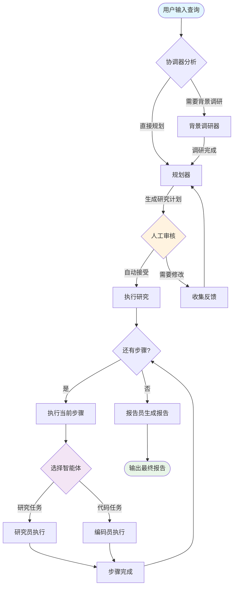
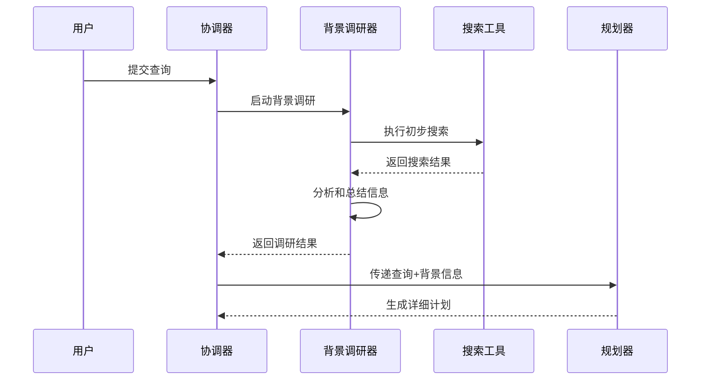
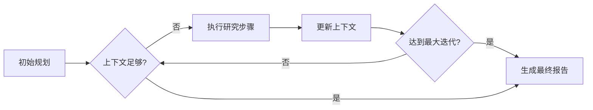
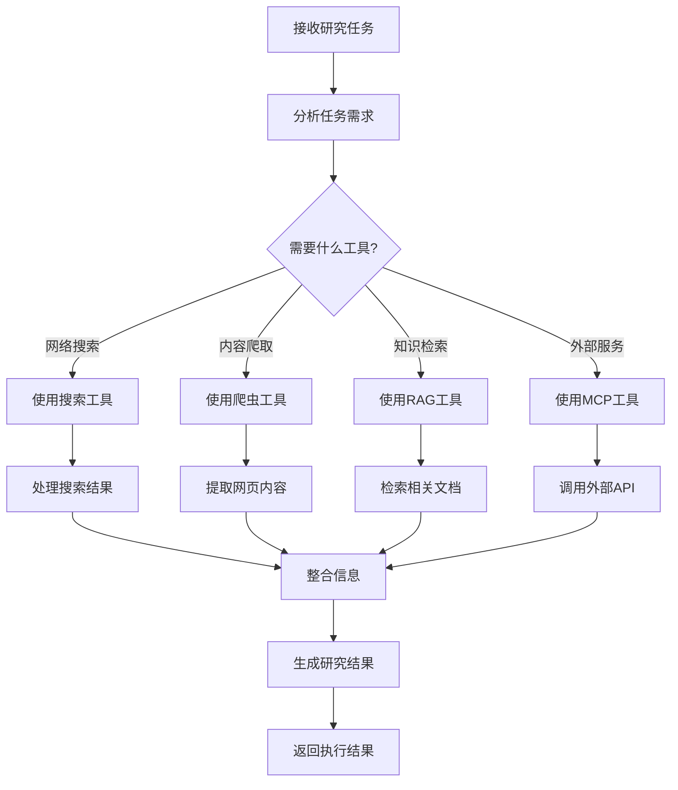
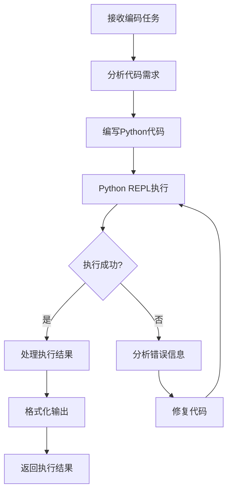
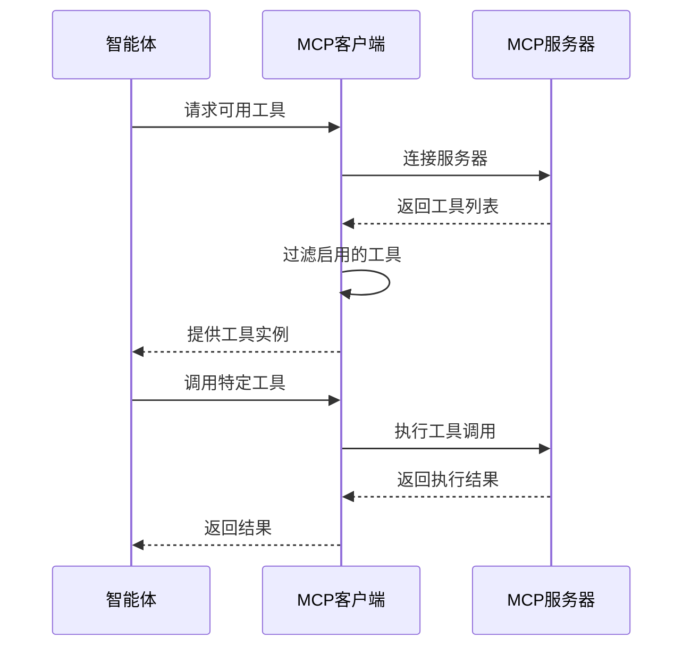
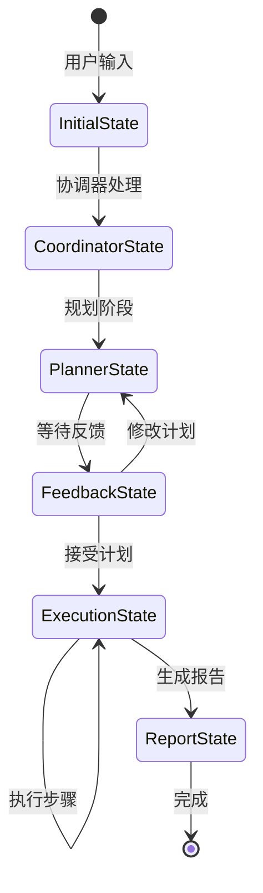
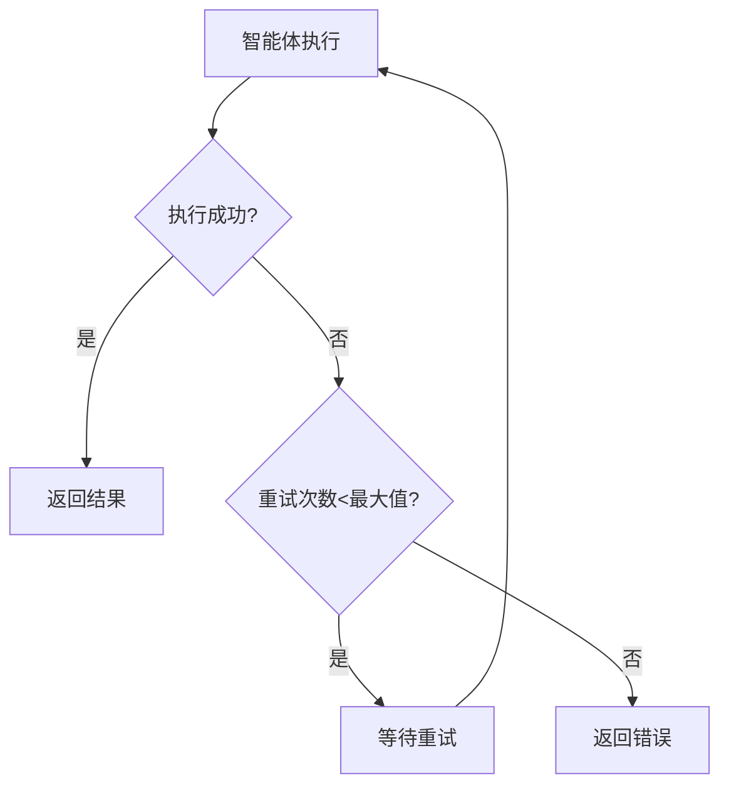

# DeerFlow 工作流程详解

## 核心工作流程

### 1. 整体执行流程



### 2. 背景调研流程

背景调研器在规划前进行初步信息收集，为规划器提供更好的上下文：



### 3. 规划生成流程

规划器负责将用户查询分解为可执行的研究步骤：

#### 规划器输入
- 用户原始查询
- 背景调研结果（如果有）
- 配置参数（最大步骤数、迭代次数等）

#### 规划器输出结构
```json
{
  "locale": "zh-CN",
  "has_enough_context": false,
  "steps": [
    {
      "title": "步骤标题",
      "description": "详细描述",
      "agent": "researcher|coder",
      "execution_res": ""
    }
  ]
}
```

#### 规划迭代机制


### 4. 智能体执行流程

#### 研究员智能体工作流程


#### 编码员智能体工作流程


### 5. 工具调用机制

#### 搜索工具选择逻辑
```python
def get_search_tool():
    engine = os.getenv("SEARCH_API", "tavily")
    if engine == "tavily":
        return TavilySearch(include_images=True)
    elif engine == "duckduckgo":
        return DuckDuckGoSearch()
    elif engine == "brave_search":
        return BraveSearch()
    elif engine == "arxiv":
        return ArxivSearch()
```

#### MCP工具动态加载


### 6. 状态管理机制

#### 状态更新流程


#### 状态持久化
- **内存存储**: 开发环境使用MemorySaver
- **数据库存储**: 生产环境支持SQLite/PostgreSQL
- **状态恢复**: 支持中断后恢复执行

### 7. 错误处理和重试机制

#### 工具调用错误处理
```python
@log_io
def safe_tool_call(tool, *args, **kwargs):
    try:
        result = tool.invoke(*args, **kwargs)
        return {"success": True, "result": result}
    except Exception as e:
        logger.error(f"Tool call failed: {e}")
        return {"success": False, "error": str(e)}
```

#### 智能体执行重试


### 8. 性能优化策略

#### LLM调用优化
- **模型缓存**: 避免重复初始化
- **智能路由**: 根据任务复杂度选择模型
- **批量处理**: 合并相似请求

#### 工具调用优化
- **结果缓存**: 缓存搜索和爬虫结果
- **并发执行**: 支持工具并行调用
- **超时控制**: 防止长时间阻塞

### 9. 监控和调试

#### LangGraph Studio集成
- **实时可视化**: 查看工作流执行状态
- **状态检查**: 每个节点的输入输出
- **性能分析**: 执行时间和资源使用

#### LangSmith追踪
- **调用链追踪**: 完整的执行路径
- **错误监控**: 异常和失败统计
- **性能指标**: 响应时间和成功率

### 10. 扩展点和自定义

#### 添加新智能体
```python
def create_custom_agent(name, tools, prompt_template):
    return create_react_agent(
        name=name,
        model=get_llm_by_type("basic"),
        tools=tools,
        prompt=lambda state: apply_prompt_template(prompt_template, state)
    )
```

#### 添加新工具
```python
@tool
@log_io
def custom_tool(input_param: str) -> str:
    """自定义工具描述"""
    # 工具实现逻辑
    return result
```

#### 自定义工作流节点
```python
def custom_node(state: State, config: RunnableConfig) -> Command:
    """自定义节点实现"""
    # 节点处理逻辑
    return Command(update={...}, goto="next_node")
```

这个工作流程设计确保了系统的可靠性、可扩展性和可维护性，同时提供了丰富的监控和调试能力。
