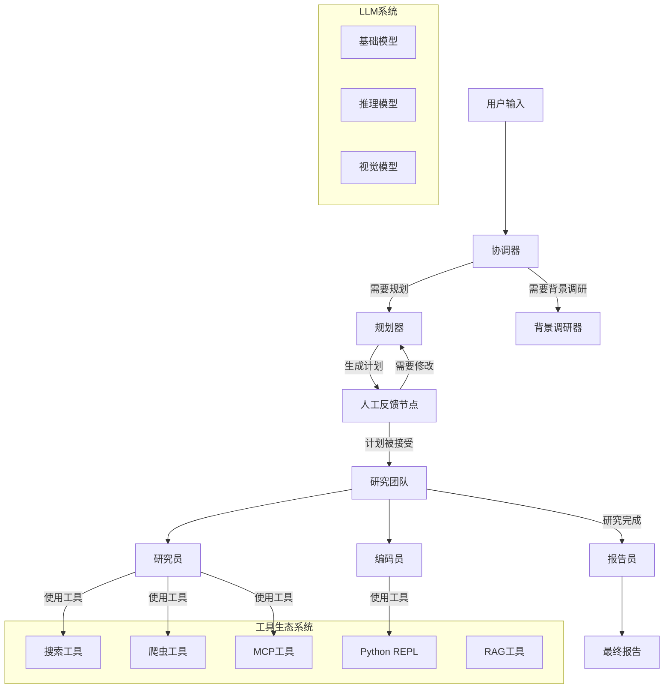
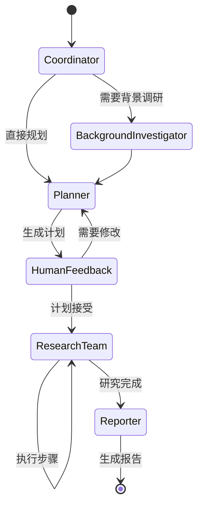

# DeerFlow 项目架构详解

## 项目概述

**DeerFlow** (Deep Exploration and Efficient Research Flow) 是一个基于社区驱动的深度研究框架，旨在结合大语言模型与专业工具（如网络搜索、爬虫、Python代码执行等）来完成复杂的研究任务。

### 核心特性
- 🤖 **多模型LLM集成** - 支持通过litellm集成大多数模型
- 🔍 **多搜索引擎支持** - Tavily、Brave Search、DuckDuckGo、Arxiv
- 🔗 **MCP无缝集成** - 扩展私有域访问、知识图谱、网页浏览等能力
- 🧠 **人机协作** - 支持研究计划的交互式修改
- 📝 **报告后编辑** - 支持类似Notion的块编辑
- 🎙️ **内容创作** - AI驱动的播客脚本生成和PPT创建

## 系统架构

### 整体架构图



### 核心组件详解

#### 1. 协调器 (Coordinator)
- **职责**: 工作流生命周期管理的入口点
- **功能**: 
  - 根据用户输入启动研究过程
  - 决定是否需要背景调研
  - 将任务委派给规划器
  - 作为用户和系统的主要接口

#### 2. 规划器 (Planner)
- **职责**: 任务分解和规划的战略组件
- **功能**:
  - 分析研究目标并创建结构化执行计划
  - 确定是否有足够的上下文信息
  - 管理研究流程并决定何时生成最终报告
  - 支持多轮规划迭代

#### 3. 研究团队 (Research Team)
执行具体研究任务的专业智能体集合：

##### 研究员 (Researcher)
- **工具集**: 网络搜索、爬虫、MCP服务
- **职责**: 信息收集和网络研究

##### 编码员 (Coder)  
- **工具集**: Python REPL
- **职责**: 代码分析、执行和技术任务

#### 4. 报告员 (Reporter)
- **职责**: 研究输出的最终处理器
- **功能**:
  - 汇总研究团队的发现
  - 处理和组织收集的信息
  - 生成全面的研究报告

## 技术栈详解

### 核心框架
- **LangGraph**: 多智能体编排和状态管理
- **LangChain**: LLM交互和工具链
- **FastAPI**: 后端API服务
- **Next.js**: 前端Web UI

### LLM配置系统

```python
# LLM类型定义
LLMType = Literal["basic", "reasoning", "vision"]

# 智能体-LLM映射
AGENT_LLM_MAP = {
    "coordinator": "basic",
    "planner": "basic", 
    "researcher": "basic",
    "coder": "basic",
    "reporter": "basic"
}
```

### 工具系统架构

#### 搜索工具
- **Tavily**: 专为AI应用设计的搜索API
- **DuckDuckGo**: 注重隐私的搜索引擎
- **Brave Search**: 具有高级功能的隐私搜索
- **Arxiv**: 学术论文搜索

#### 爬虫工具
- **Jina爬虫**: 高级内容提取
- **返回格式**: Markdown格式的可读内容

#### Python REPL工具
- **功能**: 代码执行和数据分析
- **安全性**: 沙箱环境执行
- **输出**: 结构化的执行结果

#### RAG集成
- **RAGFlow集成**: 支持私有知识库检索
- **配置**: 通过环境变量配置API端点和密钥

#### MCP (Model Context Protocol) 集成
- **动态工具加载**: 运行时加载MCP服务器工具
- **多服务器支持**: 同时连接多个MCP服务器
- **工具过滤**: 基于智能体类型过滤可用工具

## 状态管理

### 核心状态结构
```python
class State(MessagesState):
    locale: str = "en-US"                    # 语言设置
    observations: list[str] = []             # 观察结果
    resources: list[Resource] = []           # 资源列表
    plan_iterations: int = 0                 # 规划迭代次数
    current_plan: Plan | str = None          # 当前计划
    final_report: str = ""                   # 最终报告
    auto_accepted_plan: bool = False         # 自动接受计划
    enable_background_investigation: bool = True  # 启用背景调研
```

### 工作流程状态转换



## 配置系统

### 环境配置
- **.env文件**: API密钥和基础配置
- **conf.yaml**: LLM模型配置
- **动态配置**: 运行时可调整参数

### 提示词模板系统
- **Jinja2模板**: 灵活的提示词模板
- **动态变量**: 基于状态的变量替换
- **多语言支持**: 支持中英文提示词

## 扩展功能

### 播客生成
- **脚本生成**: AI驱动的播客脚本创作
- **音频合成**: TTS音频生成
- **音频混合**: 背景音乐和音效处理

### PPT生成  
- **内容组织**: 自动结构化内容
- **模板应用**: 可定制的演示模板
- **Marp集成**: 基于Markdown的PPT生成

### 文本优化
- **多种模式**: 继续、改进、缩短、扩展、修复
- **AI辅助**: 智能文本润色和优化

## 部署架构

### 开发环境
```bash
# Python后端
uv run main.py

# Web UI开发
cd web && pnpm dev
```

### 生产环境
```bash
# Docker单容器
docker build -t deer-flow-api .
docker run -d -p 8000:8000 deer-flow-api

# Docker Compose (前后端)
docker compose up
```

### 调试工具
- **LangGraph Studio**: 可视化工作流调试
- **LangSmith**: 追踪和监控
- **实时状态检查**: 每个步骤的状态可视化

## 总结

DeerFlow通过模块化的多智能体架构，实现了从用户查询到最终报告的完整研究流程。其核心优势在于：

1. **灵活的工具集成**: 支持多种搜索引擎、爬虫和MCP服务
2. **智能的任务分解**: 自动将复杂查询分解为可执行步骤  
3. **人机协作**: 支持计划审核和修改
4. **可扩展架构**: 易于添加新的工具和智能体
5. **多模态输出**: 支持文本、音频、PPT等多种输出格式

这种设计使得DeerFlow能够处理各种复杂的研究任务，从学术研究到商业分析，从技术调研到内容创作。
